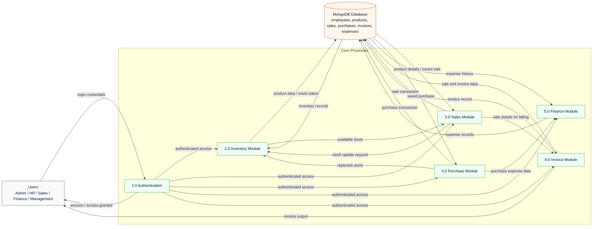

# IBOP Level-1 Data Flow Diagram

This Level-1 DFD shows the main data movement in IBOP using only the core modules implemented in the project.

## Mermaid Diagram

## Diagram Notes

- Users represent the authorized roles used in the project: Admin, HR, Sales, Finance, and Management.
- Authentication is shown as the entry point before users access the business modules.
- Inventory receives read and update flows from sales and purchases.
- Sales create transaction data and trigger inventory updates.
- Purchase activity replenishes inventory and sends expense-related information to finance.
- Invoice generation reads sale data and writes invoice records to the database.

## Relationship Summary

- Users authenticate once and then interact with the main business processes.
- All core modules exchange data with MongoDB.
- Sales and purchases both influence inventory levels.
- Finance stores and reads expense data.
- Invoices are generated from sale data and persisted in the database.