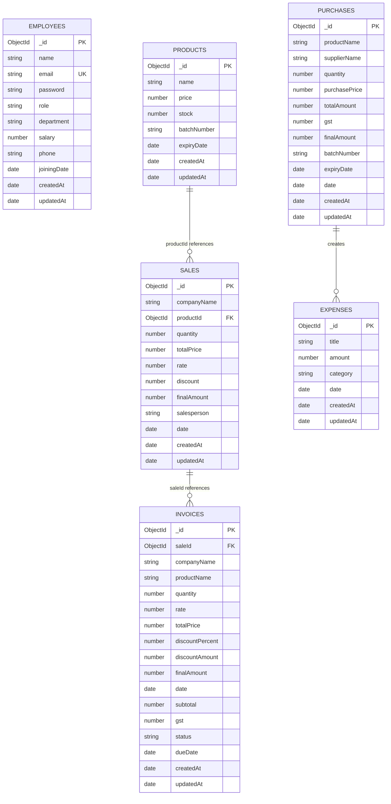

# IBOP Entity-Relationship Diagram

This ER diagram is based strictly on the current repository code. It reflects the actual Mongoose schemas, references, and data flow implemented in the backend.

## Overview

The project stores business data in six MongoDB collections:
- `employees`
- `products`
- `sales`
- `purchases`
- `invoices`
- `expenses`

The main persistent relationships are:
- A `Sale` references one `Product` through `productId`.
- An `Invoice` references one `Sale` through `saleId`.
- `Purchase` records do not use a foreign key to `Product`; they match products by `productName` in controller logic.
- `Purchase` creation also produces an `Expense` record automatically.

## ER Diagram

## Relationship Notes

### Employees
The `employees` collection stores authenticated users and staff records. It is used for:
- login authentication
- role-based authorization
- employee listing and deletion

The code currently does not define a direct foreign-key relationship from `employees` to other collections. The `salesperson` field in `sales` is stored as a string rather than an employee reference.

### Products
The `products` collection is the central inventory entity. It stores:
- product name
- selling price
- stock quantity
- optional batch number
- optional expiry date

It is referenced by `sales.productId`. The `sales` controller uses this reference to:
- verify product existence
- validate stock availability
- decrement stock when a sale is created
- restore stock when a sale is deleted

### Sales
The `sales` collection stores completed sales transactions. Each sale contains:
- company name
- selected product reference
- quantity sold
- rate
- discount
- final amount after GST
- salesperson name
- sale date

Current business logic calculates:
- total price
- discount amount
- taxable amount
- GST at 18%
- final amount

### Purchases
The `purchases` collection stores supplier purchase entries. It stores product details as plain fields, not as a MongoDB reference.

Important implementation detail:
- `purchaseController.js` searches for an existing product by `productName` using a case-insensitive match.
- If the product exists, stock is increased and price/batch/expiry are updated.
- If the product does not exist, a new `products` document is created automatically.

This means `purchases.productName` acts as an operational link to `products.name`, but it is not a formal foreign key.

### Invoices
The `invoices` collection stores invoice data derived from sales.

The invoice schema includes:
- `saleId` reference to `sales`
- duplicated sale metadata such as company name, product name, quantity, rate, and total price
- calculated financial fields such as subtotal, discount amount, GST, and final amount
- payment status
- due date

In the current codebase, invoices are created from sale data, and the status can be toggled between `paid` and `unpaid`.

### Expenses
The `expenses` collection stores business expense records.

It is used both for:
- manual expense entry through the finance module
- automatic expense creation when a purchase is recorded

For purchases, the controller creates an expense with:
- title: `Purchase - <productName>`
- amount: purchase final amount
- category: `Purchase`

## Cardinality Summary

- One `Product` can appear in many `Sales` records.
- One `Sale` can generate invoice data, and the code treats the invoice as tied to a single sale.
- One `Purchase` can trigger one automatically created `Expense` record.
- One `Employee` can log in and manage data according to role, but no schema-level reference connects employees to sales, purchases, or expenses.

## Important Design Characteristics

1. The schema is partially normalized.
   - `sales` uses a product reference.
   - `invoices` duplicates sale data for reporting and PDF generation.
   - `purchases` stores product names instead of product IDs.

2. Business logic is implemented in controllers rather than in the database layer.
   - Stock updates happen in controller code.
   - GST and discount calculations happen in controller code.
   - Expense creation from purchases happens in controller code.

3. Role information is stored in `employees.role` and used for authorization in middleware.

4. The project uses timestamps on most collections, which support reporting and sorting by creation date.

## Suggested Diagram Use in Academic Report

This ER diagram can be used for:
- database design section
- architecture chapter
- implementation chapter
- presentation slides
- system analysis documentation

## Summary

The current IBOP database design centers around inventory, sales, purchases, invoices, expenses, and employee authentication. The most important formal references are `Sales -> Products` and `Invoices -> Sales`, while purchases drive inventory and expense updates through controller logic.
