# IBOP JWT Authentication and Authorization Flow

This diagram is based strictly on the implemented IBOP authentication workflow for Shrinath Enterprises.

## Mermaid Code

```mermaid
flowchart LR
    U[Users<br/>Admin, HR, Sales, Finance, Management, Supply Chain]
    F[React Login Form]
    API[Express.js Authentication API<br/>POST /employees/login]
    V[Employee Credential Validation]
    DB[(MongoDB Employee Collection)]
    JWT[JWT Token Generation]
    RES[Token Response to Client]
    PROT[Protected Route Requests]
    MID[JWT Middleware Verification]
    RBAC[Role-Based Access Control<br/>authorizeRoles]
    GRANT[Access Granted]
    DENY[Access Denied]

    U -->|User Login Request| F
    F -->|Email + Password| API
    API -->|Lookup employee by email| V
    V -->|Find employee record| DB
    DB -->|Employee data / hashed password| V
    V -->|bcrypt compare + validation| JWT
    JWT -->|Signed token with id and role| RES
    RES -->|Store token in client state / localStorage| F
    F -->|Protected route request with Bearer token| PROT
    PROT -->|Authorization header| MID
    MID -->|jwt.verify + load employee| DB
    DB -->|Employee role| MID
    MID -->|Authenticated request| RBAC
    RBAC -->|Role allowed| GRANT
    RBAC -->|Role denied| DENY

    classDef users fill:#f8fafc,stroke:#64748b,stroke-width:1px,color:#0f172a;
    classDef process fill:#eff6ff,stroke:#2563eb,stroke-width:1px,color:#0f172a;
    classDef datastore fill:#fff7ed,stroke:#c2410c,stroke-width:1px,color:#0f172a;
    classDef decision fill:#fef3c7,stroke:#d97706,stroke-width:1px,color:#0f172a;
    classDef outcome fill:#ecfdf5,stroke:#16a34a,stroke-width:1px,color:#0f172a;
    classDef deny fill:#fef2f2,stroke:#dc2626,stroke-width:1px,color:#0f172a;

    class U users;
    class F,API,V,JWT,RES,PROT,MID,RBAC process;
    class DB datastore;
    class GRANT outcome;
    class DENY deny;
```

## Diagram Notes

- The login form sends credentials to the Express authentication API.
- The backend validates the employee by email and compares the password using bcrypt.
- A JWT token is generated with the employee id and role.
- The frontend stores the token and attaches it as a Bearer token for protected requests.
- The protect middleware verifies the token and loads the employee from MongoDB.
- The authorizeRoles middleware applies role-based access control.
- The flow shown here matches the current repository implementation and avoids extra infrastructure.
