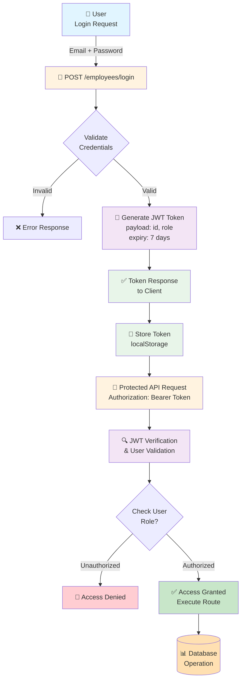

# JWT Authentication Implementation Flow - IBOP

```mermaid
flowchart TD
    A["👤 User<br/>Login Request"] -->|Email + Password| B["🔐 POST /employees/login"]
    B --> C{"Validate<br/>Credentials"}
    C -->|Invalid| D["❌ Error Response"]
    C -->|Valid| E["🔑 Generate JWT Token<br/>payload: id, role<br/>expiry: 7 days"]
    E --> F["✅ Token Response<br/>to Client"]
    F --> G["💾 Store Token<br/>localStorage"]
    G --> H["📡 Protected API Request<br/>Authorization: Bearer Token"]
    H --> I["🔍 JWT Verification<br/>& User Validation"]
    I --> J{"Check User<br/>Role?"}
    J -->|Unauthorized| K["🚫 Access Denied"]
    J -->|Authorized| L["✅ Access Granted<br/>Execute Route"]
    L --> M[("📊 Database<br/>Operation")]
    
    style A fill:#e1f5ff
    style B fill:#fff3e0
    style E fill:#f3e5f5
    style F fill:#e8f5e9
    style G fill:#e8f5e9
    style H fill:#fff3e0
    style I fill:#f3e5f5
    style L fill:#c8e6c9
    style K fill:#ffcdd2
    style M fill:#ffe0b2
```

