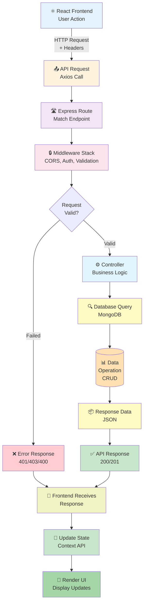

# Backend API Request Workflow - IBOP

```mermaid
flowchart TD
    A["⚛️ React Frontend<br/>User Action"] -->|HTTP Request<br/>+ Headers| B["📤 API Request<br/>Axios Call"]
    B --> C["🛣️ Express Route<br/>Match Endpoint"]
    C --> D["🔒 Middleware Stack<br/>CORS, Auth, Validation"]
    D --> E{"Request<br/>Valid?"}
    E -->|Failed| F["❌ Error Response<br/>401/403/400"]
    E -->|Valid| G["⚙️ Controller<br/>Business Logic"]
    G --> H["🔍 Database Query<br/>MongoDB"]
    H --> I[("📊 Data<br/>Operation<br/>CRUD")]
    I --> J["📦 Response Data<br/>JSON"]
    J --> K["✅ API Response<br/>200/201"]
    F --> L["📱 Frontend Receives<br/>Response"]
    K --> L
    L --> M["🔄 Update State<br/>Context API"]
    M --> N["🎨 Render UI<br/>Display Updates"]
    
    style A fill:#e3f2fd
    style B fill:#fff3e0
    style C fill:#f3e5f5
    style D fill:#fce4ec
    style G fill:#e1f5fe
    style H fill:#fff9c4
    style I fill:#ffe0b2
    style J fill:#fff9c4
    style K fill:#c8e6c9
    style F fill:#ffcdd2
    style L fill:#f0f4c3
    style M fill:#c8e6c9
    style N fill:#a5d6a7
```

