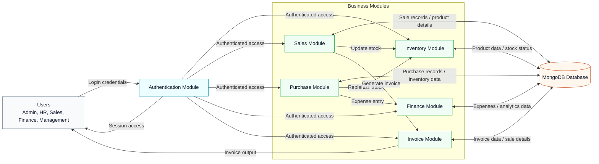

# IBOP Level-1 Data Flow Diagram

This Level-1 DFD presents the Integrated Business Operations Platform (IBOP) developed for Shrinath Enterprises. It focuses on the main business processes and their interaction with users and the MongoDB database.

## Mermaid Code

## Diagram Notes

- The layout is intentionally simplified for academic report readability.
- Only the major IBOP modules are included.
- The diagram avoids controller-level and API-level implementation details.
- Data flows are shown at a high level to match a Level-1 DFD.
- The diagram is suitable for a single dissertation page.
