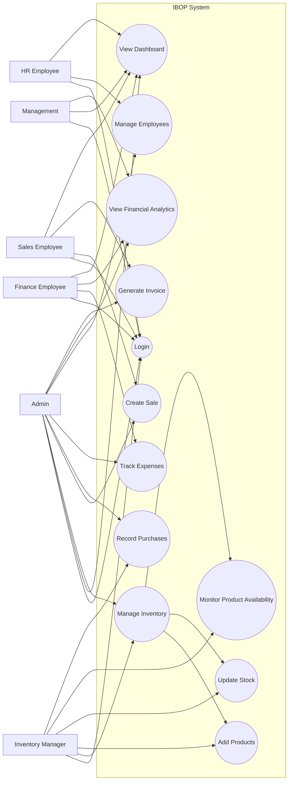

# IBOP UML Use Case Diagram

This use case diagram is based strictly on the implemented IBOP project for Shrinath Enterprises. The actor labeled Inventory Manager corresponds to the implemented Supply Chain role in the repository.

## Mermaid Source Sketch

## Notes

- Actors are arranged in a balanced way to reduce line crossing and avoid visual isolation.
- The diagram includes only workflows visible in the current repository.
- No controller-level or API-level details are shown.
- Inventory Manager is used as the academic label for the implemented Supply Chain responsibilities.
