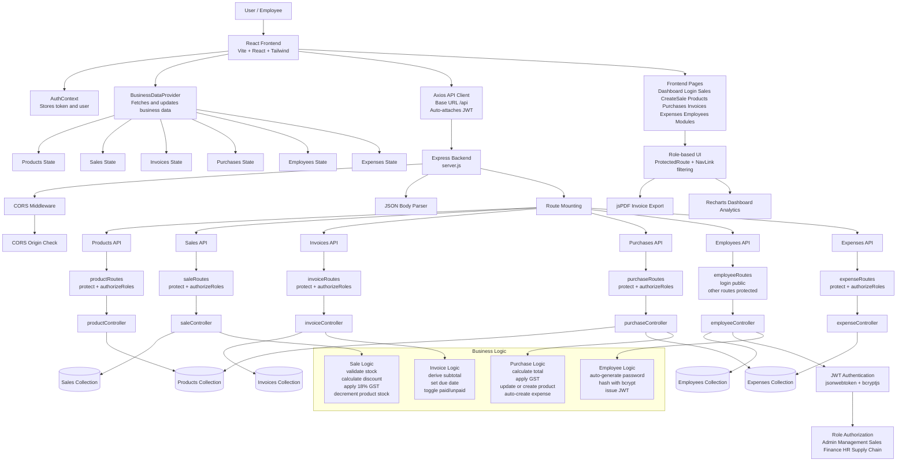

# IBOP System Architecture Diagram

This diagram reflects the current implementation of the Integrated Business Operations Platform (IBOP) repository.

## Mermaid Diagram

## Architecture Notes

- The frontend is a single-page React application built with Vite.
- Authentication state is persisted in localStorage and shared through AuthContext.
- Business data is loaded and synchronized through BusinessDataProvider.
- All API requests go through a shared Axios instance that injects the JWT token.
- The backend is an Express REST API with route-level role checks.
- MongoDB is accessed through Mongoose models for employees, products, sales, purchases, invoices, and expenses.
- Purchase creation automatically updates inventory and creates an expense record.
- Sale creation validates inventory and reduces product stock.
- Invoice records are derived from sale data and support PDF export on the frontend.
